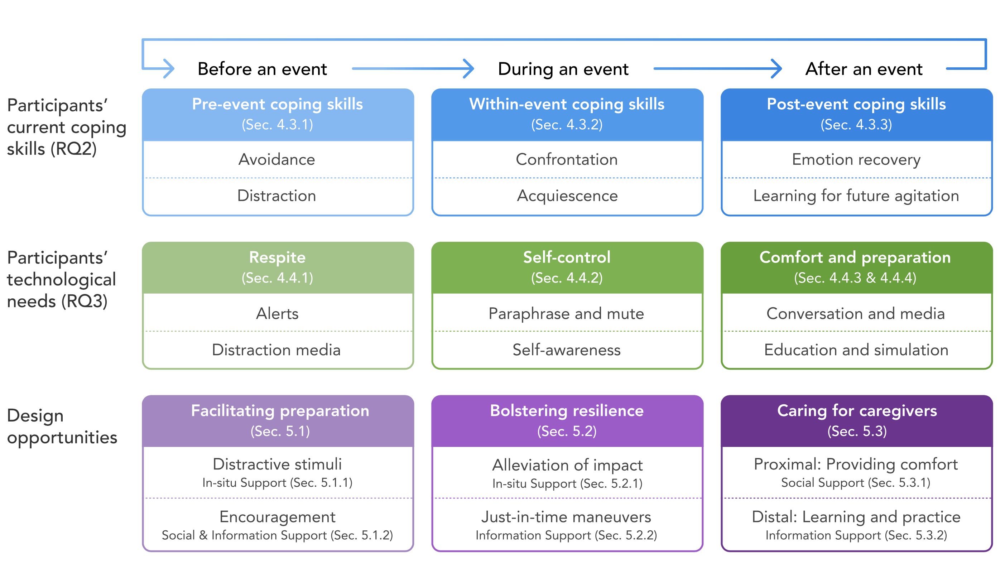

# Opportunities in Mental Health Support for Informal Dementia Caregivers Suffering from Verbal Agitation

<!-- _yay_ -->

<div class="authorlists" align="center">
	<div class="author">
		
		<div class="authorname">
			<a href="https://hcikim.github.io/" target="_blank">Taewook Kim<br></a>Northwestern University
		</div>
	</div>
	<div class="author">
		
		<div class="authorname">
			<a href="https://hyeok.me/" target="_blank">Hyeok Kim<br></a>Northwestern University
		</div>
	</div>
	<div class="author">
		
		<div class="authorname">
			<a href="https://www.uwo.ca/fhs/csd//about/faculty/roberts_a.html" target="_blank">Angela Roberts<br></a>Western University
		</div>
	</div>
	<div class="author">
		
		<div class="authorname">
			<a href="https://sites.northwestern.edu/nupath/people/" target="_blank">Maia Jacobs<br></a>Northwestern University
		</div>
	</div>
	<div class="author">
		
		<div class="authorname">
			<a href="https://www.mjskay.com/" target="_blank">Matt Kay<br></a>Northwestern University
		</div>
	</div>
</div>


<br>

## Abstract

People with dementia (PwD) often present verbal agitation such as cursing, screaming, and persistently complaining. Verbal agitation can impose mental distress on informal caregivers (e.g., family, friends), which may cause severe mental illnesses, such as depression and anxiety disorders. To improve informal caregivers' mental health, we explore design opportunities by interviewing 11 informal caregivers suffering from verbal agitation of PwD. In particular, we first characterize how the predictability of verbal agitation impacts informal caregivers' mental health and how caregivers' coping strategies vary before, during, and after verbal agitation. Based on our findings, we propose design opportunities to improve the mental health of informal caregivers suffering from verbal agitation: distracting PwD (in-situ support; before), prompting just-in-time maneuvers (information support; during), and comfort and education (social & information support; after). We discuss our reflections on cultural disparities between participants. Our work envisions a broader design space for supporting informal caregivers' well-being and describes when and how that support could be provided.

<br>

## Research Questions


<ul>
  <li><b>RQ1</b>: In what exact situations do informal caregivers experience verbal agitation of PwD?</li>
  <li><b>RQ2</b>: How do informal caregivers of PwD cope with the situation of verbal agitation?</li>
  <li><b>RQ3</b>: What kind of technological support could be useful for the mental well-being of
informal caregivers experiencing verbal agitation of PwD?</li>
</ul>

<br>

## Design Framework

We synthesize our findings on current coping strategies (RQ2) and technology suggestions (RQ3) of
our participants (informal caregivers) to derive design opportunities for before/during/after verbal agitation.

<div class="ui" align="center">
	
</div>


<br>

## Design Ideas

A potential example of application, modalities, and artifacts for i) before, ii) during, and iii) after verbal agitation of PwD for improving informal caregivers’ mental well-being.

<div class="ui" align="center">
	
</div>


<br>

## BibTeX

<button onclick="openWin()">Camera-Ready (PDF)</button>
<button onclick="copyfunc()" id="copy">Copy to Clipboard</button>

```
TBD
```

<br>

<script>
	function openWin() {
		window.open("https://hcikim.github.io/assets/CSCW_dementia.pdf");
	}
</script>

[◀︎ back](./)
