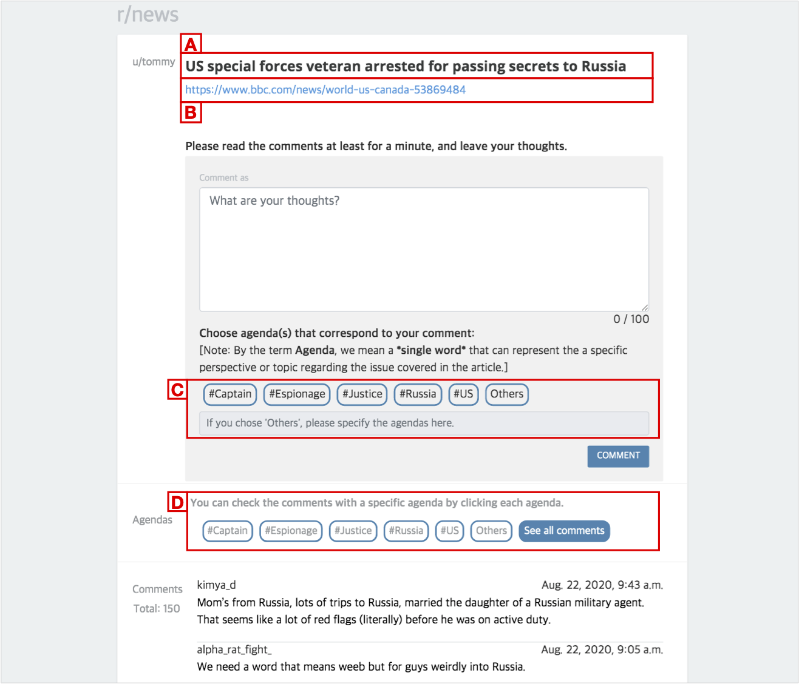

# Improving Readers’ Awareness of Divergent Viewpoints by Displaying Agendas of Comments in Online News Discussions

<!-- _yay_ -->

<div class="authorlists" align="center">
	<div class="author">
		
		<div class="authorname">
			<a href="https://hcikim.github.io/" target="_blank">Taewook Kim<br></a>HKUST
		</div>
	</div>
	<div class="author">
		
		<div class="authorname">
			<a href="https://hyunwoo.me/" target="_blank">Hyunwoo Kim<br></a>KAIST
		</div>
	</div>
	<div class="author">
		
		<div class="authorname">
			<a href="https://juhokim.com/" target="_blank">Juho Kim<br></a>KAIST
		</div>
	</div>
	<div class="author">
		
		<div class="authorname">
			<a href="https://www.cse.ust.hk/~mxj/" target="_blank">Xiaojuan Ma<br></a>HKUST
		</div>
	</div>
</div>

<br>
<div class="demo" align="center">
	
</div>
<br>

## Abstract

Readers of online news articles often hold related discussions in social media, sharing comments with various news-relevant topics, which we denote as 'agendas'. Online discussions that span diverse agendas can help readers mitigate the biased influences from news media. However, displaying comments based on popular voting often fails to reveal such diversities to readers. In this paper, we designed a proof-of-concept _Hagendas_ that aims to improve awareness of divergent agendas in online news discussions. It presents possible agendas automatically derived from news articles, and enables readers to view and filter the comments accordingly. We evaluated how Hagendas would affect users' online news discussion practices through a within-subjects experiment with 95 online participants from MTurk. While the _agenda tags_ and _filtering_ features did not significantly increase the number of distinct agendas people identified through reading comments, 77.9% of participants preferred having those features for exploring online news discussion.

<br>

## User Interface Design

<div class="demo" align="center">
	
</div>

The user interface of Hangendas. The headline of a news article is shown on <b>\[A\]</b>, while the original article link is on <b>\[B\]</b>. The possible agendas for discussion about the news article are displayed on <b>\[C\]</b>. Users can tag any corresponding tags among <b>\[C\]</b> for their comments. Users can filter the comments by agendas provided on <b>\[D\]</b>. By clicking one of them on <b>\[D\]</b>, they can check corresponding comments for the agenda.

<br>

## BibTeX

<button onclick="openWin()">Camera-Ready (PDF)</button>
<button onclick="copyfunc()" id="copy">Copy to Clipboard</button>

```
@inbook{10.1145/3462204.3481761,
author = {Kim, Taewook and Kim, Hyunwoo and Kim, Juho and Ma, Xiaojuan},
title = {Improving Readers’ Awareness of Divergent Viewpoints by Displaying Agendas of Comments in Online News Discussions},
year = {2021},
isbn = {9781450384797},
publisher = {Association for Computing Machinery},
address = {New York, NY, USA},
url = {https://doi.org/10.1145/3462204.3481761},
booktitle = {Companion Publication of the 2021 Conference on Computer Supported Cooperative Work and Social Computing},
pages = {99–103},
numpages = {5}
}
```

<br>

<script>
	function openWin() {
		window.open("https://hcikim.github.io/assets/CSCW_Hagendas.pdf");
	}
</script>

[back](./)
