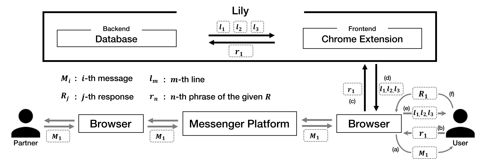

# Love in Lyrics: An Exploration of Supporting Textual Manifestation of Affection in Social Messaging

<!-- _yay_ -->

<div class="authorlists" align="center">
	<div class="author">
		
		<div class="authorname">
			<a href="https://hcikim.github.io/" target="_blank">Taewook Kim<br></a>HKUST
		</div>
	</div>
	<div class="author">
		
		<div class="authorname">
			<a href="https://leebebeto.github.io/" target="_blank">Jungsoo Lee<br></a>Korea University
		</div>
	</div>
	<div class="author">
		
		<div class="authorname">
			<a href="http://zhenhuipeng.com/index.html" target="_blank">Zhenhui Peng<br></a>HKUST
		</div>
	</div>
	<div class="author">
		
		<div class="authorname">
			<a href="https://www.cse.ust.hk/~mxj/" target="_blank">Xiaojuan Ma<br></a>HKUST
		</div>
	</div>
</div>

<br>
<div class="demo" align="center">
	
</div>
<br>

## Abstract

Affectionate communication, the conveyance of closeness, care, and fondness for another, plays a key role in romantic relationships. While the pervasive use of digital technology for communication limits affectionate interaction through nonverbal cues -- a major channel of expression in face-to-face settings, there have been few approaches which scaffold couples' romantic text conversations. To bridge this gap, we propose a novel interactive system Lily which gives users inspirations to enrich their romantic expressions in text messaging. It first listens to users' original input and then recommends romantic lyrics holding the closest meaning in real-time during chats with partners. After a three-day empirical study, participants who are real-life couples reported that they not only received useful cues from Lily in terms of how to polish their affectionate expressions, but also learnt to enrich the conversation with topics enlightened by its recommendations. Based on our findings, we finally provide several design considerations for actual deployment of such an application.

<br>

## UI & Framework

<div class="ui" align="center">
	
</div>

(A) is the initial user interface of our system. It shows where the recommendations would appear by displaying three blank oval shapes. (B) shows users’ typing input and three recommended lines of romantic song lyrics. (C) shows the randomized results of our system. Even if users type the same words, it will not always return the exact same lines.

<br>

<div class="ui" align="center">
	
</div>

The overview of our system framework. (a) Once a user receives a message(M<sub>1</sub>) from his/her partner, (b) the user types some phrases(*r<sub>1</sub>*) to reply in the input line. (c) Then the system reads the phrases(*r<sub>1</sub>*). (d) The system then returns three corresponding lines(*l<sub>1</sub>, l<sub>2</sub>, l<sub>3</sub>*) of lyrics. (e) The lines(*l<sub>1</sub>, l<sub>2</sub>, l<sub>3</sub>*) are presented on the chat UI so that (f) the user can refer to them(*l<sub>1</sub>, l<sub>2</sub>, l<sub>3</sub>*) to refine their response(*R<sub>1</sub>*) before sending it.

<br>

## Usage example

<div class="ui" align="center">
	
</div>

P3 and P4 are in a relationship. On the second day of the experiment, P4 asked P3 a question during the chat, *‘Which one do you prefer? short hair or long hair?’*. In the context of typing a response to the this question, P3 was inspired by the recommendations provided. The figure illustrates the whole process which P3 followed to enrich his response.

<br>

## BibTeX

<button onclick="openWin()">Camera-Ready (PDF)</button>
<button onclick="copyfunc()" id="copy">Copy to Clipboard</button>

```
@article{10.1145/3359181,
author = {Kim, Taewook and Lee, Jung Soo and Peng, Zhenhui and Ma, Xiaojuan},
title = {Love in Lyrics: An Exploration of Supporting Textual Manifestation of Affection in Social Messaging},
year = {2019},
issue_date = {November 2019},
publisher = {Association for Computing Machinery},
address = {New York, NY, USA},
volume = {3},
number = {CSCW},
url = {https://doi.org/10.1145/3359181},
doi = {10.1145/3359181},
journal = {Proc. ACM Hum.-Comput. Interact.},
month = {nov},
articleno = {79},
numpages = {27},
keywords = {text messaging, lyrics, recommendation, affectionate communication, interpersonal communication, expression}
}
```

<br>

<script>
	function openWin() {
		window.open("https://hcikim.github.io/assets/CSCW_Lily.pdf");
	}
</script>

[◀︎ back](./)
